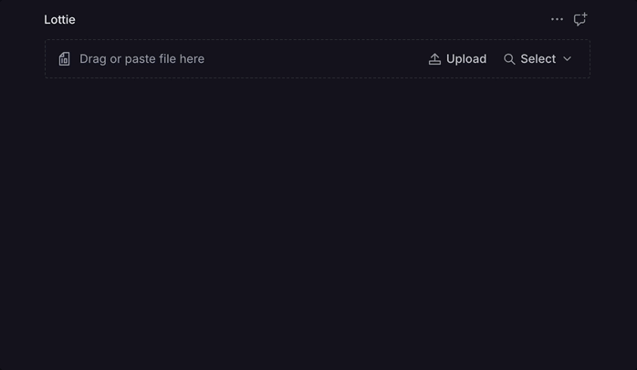

<div align="center">
  <h1>Sanity Lottie Plugin</h1>
  <h3>A Sanity plugin to upload and preview Lottie files in your studio.</h3>
  <p><em>Developed and maintained by <a href="https://contentwrap.io" target="_blank">ContentWrap</a></em></p>

  
  
  
  
  
  <br>
  <br>

  
</div>

---

## Features

- **Easy integration**: Add a Lottie animation field to your Sanity schema.
- **Instant preview**: See your Lottie animation right in the Studio after upload.
- **File validation**: Only accepts valid Lottie `.json` files.
- **Animation info**: Displays duration, frame count, and frame rate.

---

## Installation

```sh
pnpm add sanity-plugin-lottie
# or
yarn add sanity-plugin-lottie
# or
npm install sanity-plugin-lottie
```

---

## Usage

**1. Add the plugin to your Sanity config:**

```ts
// sanity.config.ts
import { defineConfig } from 'sanity';
import { lottiePreview } from 'sanity-plugin-lottie';

export default defineConfig({
  // ...
  plugins: [lottiePreview()],
});
```

**2. Use the `lottie` type in your schema:**

```ts
// schemas/myDocument.ts
import { defineType } from 'sanity';

export default defineType({
  name: 'myDocument',
  title: 'My Document',
  type: 'document',
  fields: [
    {
      name: 'animation',
      title: 'Lottie Animation',
      type: 'lottie',
    },
    // ... other fields
  ],
});
```

---

## How it works

- Upload a Lottie `.json` file in the Studio.
- Instantly preview the animation, with info on duration, frames, and frame rate.
- Only valid Lottie `.json` files are accepted.

---

## Requirements

- Sanity Studio v3 or v4
- Lottie `.json` files (exported from After Effects or similar tools)

---

## License

MIT © ContentWrap

---

## About the Developer

This package is developed and maintained by [ContentWrap](https://contentwrap.io), a digital product agency specializing in Sanity and modern web development.
